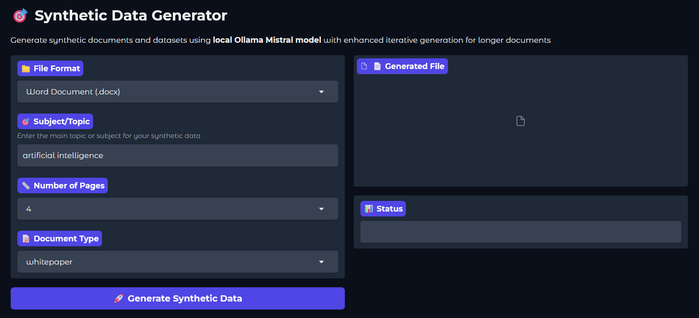

# 🎯 Synthetic Data Generator

A powerful, modular Python application that generates synthetic documents and datasets using local Ollama Mistral AI model. Create professional documents, Excel spreadsheets, and CSV files with contextually relevant content for testing, development, and demonstration purposes.

## 🚀 Features

### 📄 Document Generation
- **Multiple Formats**: Word (.docx), PDF (.pdf), Text (.txt)
- **Document Types**: Whitepapers, Articles, Reports, Proposals, Design Documents
- **Iterative Generation**: Section-by-section creation for longer documents (3+ pages)
- **Professional Formatting**: Proper headings, lists, and styling
- **Page Control**: Generate documents from 1-50 pages

### 📊 Data Generation
- **Excel & CSV Support**: Generate structured datasets
- **Smart Headers**: Context-aware column names based on subject
- **Scalable**: From 10 to 2000+ rows with up to 100 columns
- **Subject-Aware Content**: Data contextually relevant to your topic
- **Clean Output**: Filtered and validated data with fallback mechanisms

### 🎯 Subject-Aware Intelligence
- **Contextual Content**: All generated content relates to your specified subject
- **Smart Templates**: Pre-configured section templates for different document types
- **Industry-Specific**: Specialized headers and content for AI, healthcare, finance, etc.
- **Custom Topics**: Works with any subject you specify

### 🔧 Technical Features
- **Local AI**: Uses Ollama Mistral model (no cloud dependencies)
- **Modular Architecture**: Clean, maintainable code structure
- **Web Interface**: User-friendly Gradio UI
- **Progress Tracking**: Real-time generation status
- **Error Handling**: Robust fallback mechanisms

### Main Interface


### Output


## 📁 Project Structure

```
SyntheticDataCreator/
├── main.py                    # Main entry point
├── generators/
│   ├── __init__.py           # Package initialization
│   ├── data_generator.py     # Core generator class
│   ├── document_generator.py # Document-specific methods
│   └── excel_generator.py    # Excel/CSV-specific methods
├── config/
│   ├── __init__.py          # Package initialization
│   └── settings.py          # Configuration and options
├── utils/
│   ├── __init__.py          # Package initialization
│   └── helpers.py           # Helper functions
├── ui/
│   ├── __init__.py          # Package initialization
│   └── interface.py         # Gradio interface
└── README.md                # This file
```

## ⚙️ Prerequisites

### Required Software
- **Python 3.8+**
- **Ollama** with Mistral model installed and running locally

### Required Python Packages
```bash
pip install gradio requests python-docx pandas openpyxl
```

### Optional Packages
```bash
pip install reportlab  # For PDF generation
```

## 🛠️ Installation

### 1. Clone or Download
```bash
git clone 
cd SyntheticDataCreator
```

### 2. Install Dependencies
```bash
pip install -r requirements.txt
```

### 3. Install and Setup Ollama
```bash
# Install Ollama (visit ollama.ai for platform-specific instructions)
# Pull Mistral model
ollama pull mistral

# Start Ollama service
ollama serve
```

### 4. Run the Application
```bash
python main.py
```

### 5. Access the Interface
Open your browser and navigate to: `http://localhost:7860`

## 🎮 Usage Guide

### Document Generation

1. **Select Format**: Choose from Word, PDF, or Text
2. **Enter Subject**: Specify your topic (e.g., "artificial intelligence", "renewable energy")
3. **Set Pages**: Choose number of pages (1-50)
4. **Select Type**: Pick document type (whitepaper, article, report, proposal, design)
5. **Generate**: Click the generate button and download your file

### Data Generation

1. **Select Format**: Choose Excel or CSV
2. **Enter Subject**: Specify your topic for contextual data
3. **Set Dimensions**: Choose number of rows and columns
4. **Generate**: Click generate and download your structured dataset

### Subject Examples

#### 🔬 Technical
- `"machine learning algorithms"`
- `"cybersecurity frameworks"`
- `"cloud computing architecture"`

#### 💼 Business
- `"digital transformation"`
- `"supply chain management"`
- `"customer analytics"`

#### 🏭 Industry-Specific
- `"healthcare innovation"`
- `"renewable energy systems"`
- `"financial technology"`

#### 🔒 Data Protection
- `"GDPR compliance"`
- `"privacy by design"`
- `"data governance"`

## 📊 Smart Data Features

### Context-Aware Headers
The system automatically generates relevant column headers based on your subject:

| Subject | Sample Headers |
|---------|---------------|
| Artificial Intelligence | AI_Model, Accuracy_Score, Training_Data, Algorithm_Type |
| Data Protection | Data_Category, Protection_Level, Compliance_Status, Risk_Score |
| Renewable Energy | Energy_Source, Capacity_MW, Efficiency_Rate, Location |
| Healthcare | Patient_ID, Treatment_Type, Outcome_Score, Duration_Days |

### Document Types & Structures

#### 📋 Whitepaper
- Executive Summary
- Introduction & Background
- Technical Analysis
- Methodology
- Implementation Details
- Results & Findings
- Conclusions & References

#### 📰 Article
- Introduction
- Main Analysis
- Case Studies & Examples
- Industry Impact
- Current Trends
- Best Practices
- Future Outlook
- Conclusion

#### 📈 Report
- Executive Summary
- Introduction & Methodology
- Market Analysis
- Data Analysis & Insights
- Strategic Recommendations
- Risk Assessment
- Implementation Plan
- Financial Analysis

## 🔧 Configuration

### Ollama Settings
The application connects to Ollama at `http://localhost:11434` by default. You can modify this in `generators/data_generator.py`:

```python
def __init__(self):
    self.ollama_url = "http://localhost:11434/api/generate"  # Modify if needed
```

### Generation Parameters
Adjust generation parameters in `generators/data_generator.py`:

```python
"options": {
    "num_predict": max_tokens or 4000,  # Token limit
    "temperature": 0.7,                 # Creativity (0.0-1.0)
    "top_p": 0.9,                      # Nucleus sampling
    "repeat_penalty": 1.1              # Repetition penalty
}
```

### File Format Options
Add or modify supported formats in `config/settings.py`:

```python
file_format_options = {
    "Word Document (.docx)": {
        "size_options": ["1", "2", "3", "4", "5", "10", "20", "30", "40", "50"],
        "content_options": ["whitepaper", "article", "report", "proposal", "design"],
        # ...
    }
}
```

## 🐛 Troubleshooting

### Common Issues

#### Ollama Connection Error
```
Error: Could not connect to Ollama
```
**Solution**: Ensure Ollama is running with `ollama serve`

#### Missing Dependencies
```
ImportError: No module named 'gradio'
```
**Solution**: Install required packages with `pip install -r requirements.txt`

#### PDF Generation Disabled
```
⚠️  Warning: ReportLab not installed. PDF generation will be disabled.
```
**Solution**: Install ReportLab with `pip install reportlab`

#### Short Document Generation
Documents not reaching requested length.
**Solution**: The system uses iterative generation for 3+ pages automatically.

### Debug Mode
Enable debug output by checking the console when running the application. You'll see:
- Generation progress for iterative documents
- CSV parsing details for Excel/CSV generation
- Error messages and fallback activation

## 🤝 Contributing

### Adding New Document Types
1. Add prompts to `generators/document_generator.py`
2. Add section configurations for iterative generation
3. Update `config/settings.py` with new options

### Adding New Data Subjects
1. Add subject headers to `generators/excel_generator.py`
2. Test with various subjects to ensure proper matching

### Adding New File Formats
1. Create generation method in appropriate generator
2. Update `config/settings.py` with format options
3. Update UI components in `ui/interface.py`

## 📄 License

This project is open-source. Please ensure compliance with Ollama and other dependency licenses.

## ⚠️ Disclaimer

This application generates **synthetic data for demonstration and testing purposes only**. All generated content is artificially created and should not be used for:
- Actual business decisions
- Real-world implementation
- Factual reference material
- Production systems without proper validation

Always consult appropriate experts and conduct proper research for real-world applications.

## 🙏 Acknowledgments

- **Ollama** for providing local AI model infrastructure
- **Mistral AI** for the language model
- **Gradio** for the web interface framework
- **Python community** for excellent libraries (pandas, python-docx, reportlab)

## 📞 Support

For issues, questions, or contributions:
1. Check the troubleshooting section above
2. Review console output for error messages
3. Ensure all prerequisites are properly installed
4. Verify Ollama is running and accessible

**Happy Generating!** 🎉 Create amazing synthetic content for your projects with ease.
